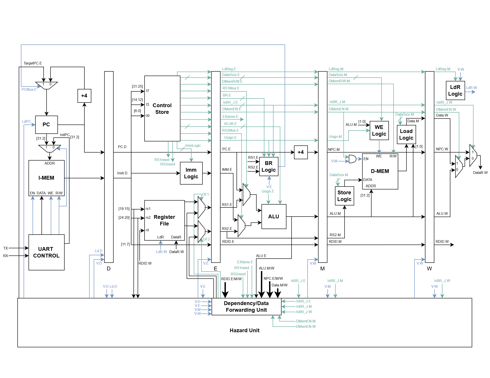

# LittleRISC-V

A pipelined RISC-V processor for FPGA platforms, built for educational purposes and hands-on learning. Current Project Time: ~50 Hours.

## Overview

The purpose of this project is to expand upon my learning of RTL design and computer architecture by implementing a 32-bit RISC-V processor core supporting the RV32I ISA. The design uses a simple 5-stage pipeline with data forwarding and hazard detection to optimize performance while handling dependencies.

## Architecture

## Implementation Details

### Pipeline Stages
1. **Fetch (F)**: Instruction fetch from instruction memory
2. **Decode (D)**: Instruction decode, register read, immediate generation
3. **Execute (E)**: ALU operations, branch/jump target calculation
4. **Memory (M)**: Data memory access for loads/stores
5. **Writeback (W)**: Register file write-back

### Memory Interface
The memory is separated into data memory in the Memory stage and instruction memory in the Fetch stage. The instruction memory is loaded either with a Vivado Mem file and `$readmemh`, or through UART control (to be implemented). Both are 32-bit word-based memory systems, with data memory using a WE logic block's 4-bit write-enable signals for byte and halfword instructions. Currently, all memory requests are carried out using negative edge clocking to avoid single-cycle delays. In a real implementation, this might be replaced with proper DDR controllers and clock domain crossing.

### ALU Execution
For arithmetic operations, a combined ALU and shifter unit carries out calculations involving the Program Counter, immediates, registers RS1/RS2, and signed/unsigned values. Address generation also occurs in this unit.

### Hazard Handling and Data Forwarding
The dependency/data forwarding unit handles all of the control and data signals needed for stalling and data forwarding. For example, the decode stage's control store contains `RS1need` and `RS2need` to track which instructions need certain values from the register file. If these values are currently in subsequent stages but have not been written back yet (detected by matching `RDID` to the RS1/RS2 needed), then we can forward these values to the decode stage with control signals `DF1` and `DF2`. The values themselves come from tapping the ALU signal for most instructions, or NPC for jumps and data for loads (decided with `IsBR_J`). If data forwarding is unavailable, such as for load instructions, we stall at decode and fetch, and insert a bubble into the execute stage. 

### Branch Prediction
Another potential chance for stalling comes from waiting for a control instruction to execute, such as a jump or branch instruction. This implementation uses simple always-not-taken branch prediction since the additional logic needed is very simple. Whenever a control instruction reaches the decode stage, execution of subsequent instructions continues until the target address is calculated in the execute stage. On a correct prediction (either for not-taken branches or jumps/branches to the next instruction), normal execution continues. Otherwise, we flush decode and execute and begin at fetch with the new PC address.

## Testing & Verification

All testing was done with a Vivado testbench using Mem files for loading instructions generated by Python. Testing included all RV32I instruction types (arithmetic, memory, branch and jump) as well as pipeline hazard and dependency scenarios.

## Challenges & Lessons Learned
### Instruction Decoding
RISC-V uses six basic instruction formats (R, I, S, B, U, J) all with different decoding schemes and immediate value generation. Both the Python code for creating the hex bits themselves as well as the control store/immediate logic had to have proper logic execution and be optimized to reduce unnecessary hardware.
### Pipeline Coordination
Careful management of each stage's valid bits and PC/decode load bits were necessary for propering pipelining function. Unbalanced coordination with data forwarding and branch predictions would either lead to suboptimal performance or pipeline stalling failures.
### Finish Signal
To decide on the exact moment the current process is done executing, and stop further pipeline stages as soon as the last instruction is complete, isn't as simple for a pipelined processor as seeing a HALT instruction. Here, a HALT is implemented as just an address in the instruction memory with all 0's. Prior stages should begin getting valid bits set to 0 as soon as a HALT enters the decode stage. However, a branch/jump might still be in the later stages of the pipeline. This was solved using a `FinishCtr` that gets reset upon a jump back, but which also stops the processor once three finish signals are set in a row

## Next Steps

Currently working on...
- [ ] Synthesizing on Basys 3 FPGA
- [ ] Writing UART interface for serial communication and instruction loading with Python

Next in line...
- [ ] Power optimization techniques, such as clock gating and dynamic voltage and frequency scaling
- [ ] Advanced Branch Prediction with two-bit predictors or branch target buffers
- [ ] More robust memory cache implementation
- [ ] Implementing RISC-V ISA extensions

## Acknowledgements
Most of this project is based on the knowledge I've gathered from my Digital System Design with HDL and Computer Architecture classes at university.

Special thanks for the specifics of the ISA coming from [RISC-V](https://github.com/riscv) RV32I.
