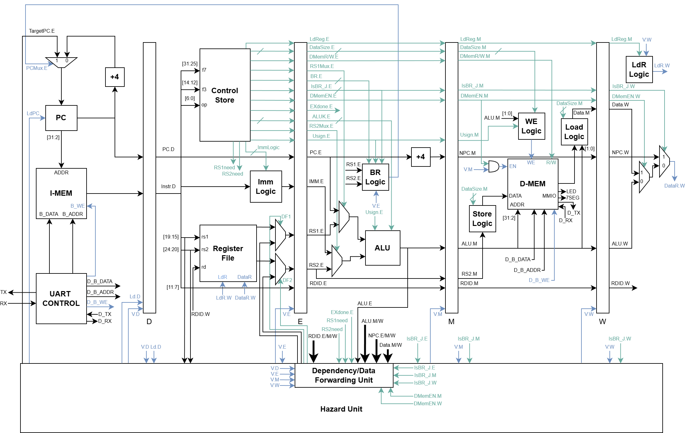

# LittleRISC-V

A pipelined RISC-V processor for FPGA platforms, built for educational purposes and hands-on learning.

**Tech Stack:**
* **Languages:** SystemVerilog, RISC-V RV32I Assembly, Python, C
* **Tools:** Xilinx Vivado, RISC-V GNU Toolchain, PySerial
* **Hardware:** Digilent Basys 3 FPGA (Artix-7)

## Overview

The purpose of this project is to expand upon my learning of RTL design and computer architecture by implementing a 32-bit RISC-V processor core supporting the RV32I ISA. The design uses a 5-stage pipeline with data forwarding and hazard detection to optimize performance. It features a hardware bootloader and a memory-mapped I/O (MMIO) controller, allowing for live C program loading and real-time serial communication.

## Architecture



### Hardware Utilization (Basys 3 / Artix-7)
*Note: The following metrics are from the Vivado Post-Synthesis Utilization Report.*

| Resource | Used | Available | Utilization |
| :--- | :--- | :--- | :--- |
| **LUTs** | 2,148 | 20,800 | 10.33% |
| **Flip-Flops** | 1,910 | 41,600 | 4.59% |
| **BRAM** | 8 | 50 | 16.00% |
| **IO** | 37 | 106 | 34.91% |
| **BUFG** | 1 | 32 | 3.13% |

## Implementation Details

### Pipeline Stages
1. **Fetch (F)**: Instruction fetch from instruction memory
2. **Decode (D)**: Instruction decode, register read, immediate generation
3. **Execute (E)**: ALU operations, branch/jump target calculation
4. **Memory (M)**: Data memory access for loads/stores
5. **Writeback (W)**: Register file write-back

### Memory & MMIO Interface
The system uses tristate buses to route memory accesses or data between the UART/debug controller and CPU. Addresses in `0x0000 - 0x3FFF` and `0x4000 - 0x7FFF` hit the dual-port block RAM for instruction and data memory respectively, while addresses above or equal to `0x8000` are routed to the MMIO controller for peripheral access.

| Address | Peripheral | Type | Description |
| :--- | :--- | :--- | :--- |
| `0x0000` | Block RAM | R/W | Instruction & data memory (dual-port) |
| `0x8000` | LEDs | Write | Register driving board LEDs |
| `0x8004` | 7-Segment | Write | Register driving the hex display |
| `0x8008` | UART Status | Read | `Bit 0`: RX Data Ready (mailbox flag)<br>`Bit 1`: TX Busy |
| `0x800C` | UART Data | R/W | **Read:** Fetches RX byte (clears RX flag)<br>**Write:** Sends TX byte (sets TX busy) |

### ALU Execution
For arithmetic operations, a combined ALU and shifter unit carries out calculations involving the Program Counter, immediates, registers RS1/RS2, and signed/unsigned values. Address generation also occurs in this unit.

### Hazard Handling and Data Forwarding
The dependency/data forwarding unit handles all of the control and data signals needed for stalling and data forwarding. 

For example, the decode stage tracks `RS1need` and `RS2need`. If these values are currently in subsequent stages but have not been written back yet (detected by matching `RDID` to the RS1/RS2 needed), then we can forward these values to the decode stage with control signals `DF1` and `DF2`.

The values themselves come from tapping the ALU signal, data for loads, or next PC (NPC) for jumps (decided with `IsBR_J`). If data forwarding is unavailable (such as waiting on a load instruction), the pipeline stalls at decode/fetch and inserts a bubble into the execute stage.

### Branch Prediction
Another potential chance for stalling comes from waiting for a control instruction to execute, such as a jump or branch instruction. This implementation uses simple always-not-taken branch prediction since the additional logic needed is very simple.

Whenever a control instruction reaches the decode stage, execution of subsequent instructions continues until the target address is calculated in the execute stage. On a correct prediction (either for not-taken branches or jumps/branches to the next instruction), normal execution continues. Otherwise, we flush decode and execute, beginning at fetch with the new PC address.

## UART Bootloader & Arbitration

Since this project targets the Basys 3 FPGA board, instructions and program data can be loaded dynamically over a USB-to-UART connection. 

* **Live UART Bootloader:** The processor uses a debug controller to interpret UART commands sent from the host PC. Using a Python script (`UART.py`), the host can halt the CPU, load compiled binaries into the instruction memory, and release the CPU to execute the new code.
* **Shared Resource Arbitration:** Both the Debugger and the CPU (via MMIO) need access to the physical UART `tx_external` pin. A hardware priority multiplexer arbitrates this bus: the Debugger owns the line during bootloading, otherwise, the CPU has control during normal execution for `printf` and echo capabilities.


## Testing & Verification

All testing was initially done with a Vivado testbench using Mem files for loading instructions generated by `testScript.py`. After this, more robust testbenches were created for UART and MMIO testing which incorporated scoreboards for automatic checking.

Then, to verify hardware with UART connected, the RISC-V GNU toolchain was used to compile programs in `main.c`:

1. **LED:** Creates a bouncing pattern of lights across the 16 Basys 3 LEDs
2. **Seg:** Rotates from 0 to 15 on the 7 segment display
3. **Fibonacci:** Tests forwarding logic with dependent instructions
4. **Echo_UART:** Takes a PC keyboard character input and echoes back the character
4. **Recursive_UART:** Computes the factorial of a keyboard integer input

*(Note: Simulation required abandoning standard `$fread` with `.bin` files due to Vivado pathing issues. This is the role of `binToRead.py`, to convert binaries to `.mem` files for `$readmemh` initialization).*

## Challenges & Lessons Learned

### Hardware UART Synchronization
During early UART testing, loading `.bin` files resulted in random failed writes and acknowledgements from the CPU. Since the physical UART transceiver asserts `rx_valid` for exactly one clock cycle (20ns at 50MHz), electrical noise or other variations caused the PC/CPU to be out of sync. To solve this, I used a small 10-cycle accumulator that resets if the start bit is not held constantly at 0 for all cycles in a row.

However, one cycle of `rx_valid` is still not enough since the CPU takes several cycles to fetch and execute its polling loop. The CPU could easily miss the pulse if it did not load from the UART Status MMIO address in the same cycle. The solution was to implement a mailbox/hardware latch and a check for a valid read signal at address `0x800C`. This way, the sticky `rx_data_ready` bit would only be cleared once it was successfully read.

### Multi-Driver Contention & Address Masking Bugs
Initially, the MMIO and memory buses lacked proper isolation. Both the CPU and UART debug controller could drive address and data buses simultaneously, causing multi-driver logic conflicts. Part of the issue was incorrect address masking since memory wraparound (`addr[13:2]`) stripped the high bits (`addr[15:14]`) used for MMIO and instruction vs data memory address checks. 

I had to correct the high-Z out of range drive logic and relocate the address mask directly inside the memory module to preserve the full address for top-level MMIO decoding. This also made it tricky to later modify memory accesses to allow the CPU to read values in ROM literals/arrays. This required muxing instruction memory's port B to give access to ROM data from data memory's module.

### Pipeline Coordination & The "Finish" Signal
Deciding exactly when a process is done executing to stop the pipeline isn't as simple as seeing a `HALT` instruction, because a branch/jump might still be resolving in later stages. This was solved using a `FinishCtr` that resets upon a jump back, but stops the processor once three finish signals are set in a row.

### Instruction Decoding Optimization
RISC-V uses six basic instruction formats (R, I, S, B, U, J) all with different decoding schemes and immediate value generation. Writing the Python assembler and the SystemVerilog control store required tight coordination to ensure correct execution while minimizing unnecessary hardware logic.

## Video Demos


*Using the Basys 3 for synthesis, this video shows the `generate_add_test()` example. The LEDs display the lower 16 bits of the execute stage ALU's input data `ALU.RS1`, and the 7-segment display shows the lower 16 hexadecimal bits of Register 1.*

<br>


*This side-by-side demo showcases the Python bootloader's interactive mode communicating with `recursive_UART()` running live on the CPU. It proves two functions:*

- *MMIO and UART Communication: The Python script sends raw bytes to the FPGA. The C code polls the MMIO, reads the byte, processes it, updates the physical LEDs/7-segment displays, and writes the result back to the TX hardware to be read by the terminal.*

- *Pipeline/Stack Stress Test: The C code executes a recursive `factorial()` function based on the user's input. Recursion tests and proves that multiple function calls involving the stack pointer (sp), jump and link, jump return, and memory push/pop operations can execute without data hazards or pipeline stalls.*

## Repository Structure

```text
├── Src/                   # Hardware design files (SystemVerilog, pin mappings, bitstream)
│   ├── InitMem/           # Memory initialization files
├── Test/                  # Software test programs and build environment
│   ├── Build/             # Compiled binary, dump, and executable files
├── Testbenches/           # Simulation testbenches for hardware verification
├── readme/                # Diagrams, schematics, demos
├── LICENSE                # Project license information
└── README.md              # Main project documentation
```

## To Get Started
The Python bootloader script `UART.py` interfaces with the FPGA's hardware debug controller over a standard USB-to-UART connection. To flash a compiled `.bin` file to the instruction memory and immediately run it:

`python UART.py --port COM3 --baud 9600 --load firmware.bin`
(Note: Replace COM3 with your FPGA's actual serial port)

Next, you can use the menu to manually interact, inspect the system state with read/dumps, halt/release, and enter interactive mode for UART programs.

## Roadmap & Future Enhancements
Recently Completed:

- [x] Synthesize on Basys 3 FPGA
- [x] UART bootloader for live instruction loading and communication
- [x] Memory-Mapped I/O (MMIO) for LEDs, 7-Segment, and serial TX/RX

Potential Next Steps:

- [ ] Optimizing for low power with clock gating, operand isolation, power islands, or other techniques
- [ ] Adding more complex UART communication with an interrupt controller and asynchronous FIFO
- [ ] Advanced branch prediction with two-bit predictors or branch target buffers
- [ ] More robust memory cache implementation
- [ ] Implementing RISC-V ISA extensions


## Acknowledgements
Most of this project is based on the knowledge I've gathered from my Digital System Design with HDL and Computer Architecture classes at university.

Special thanks for the specifics of the ISA coming from [RISC-V](https://github.com/riscv) RV32I.
